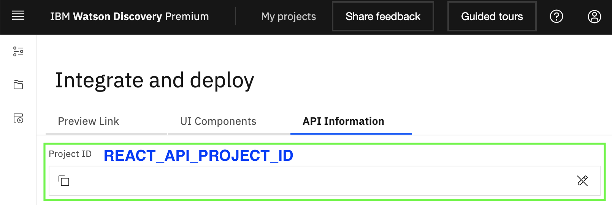
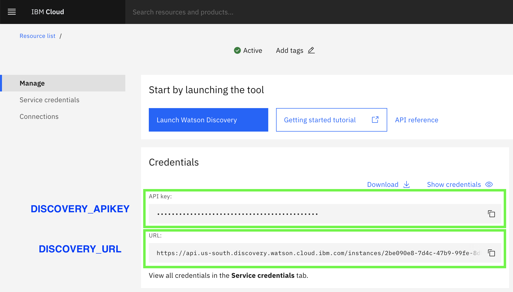
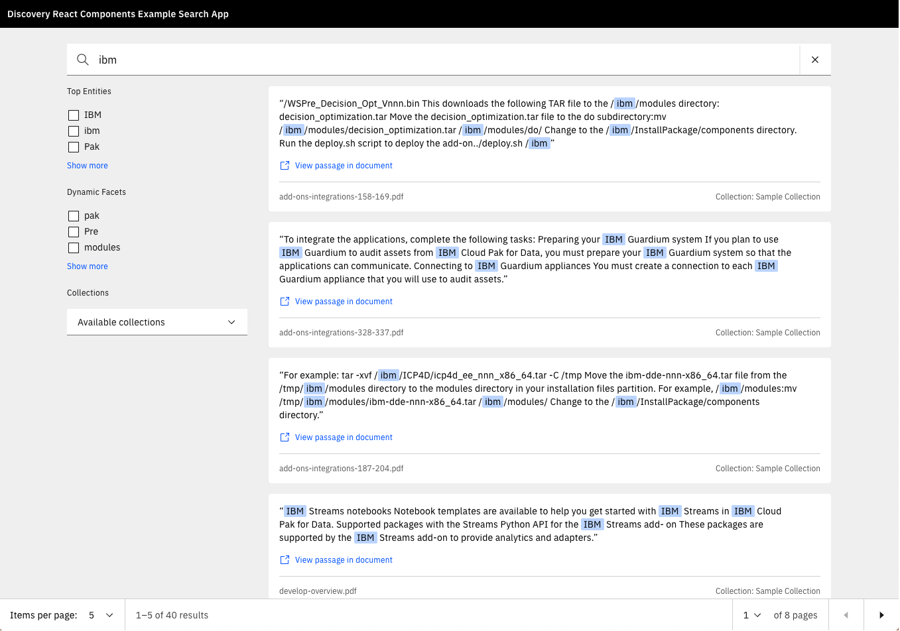

<!-- START doctoc generated TOC please keep comment here to allow auto update -->
<!-- DON'T EDIT THIS SECTION, INSTEAD RE-RUN doctoc TO UPDATE -->

- [Running the example app](#running-the-example-app)
  - [Setup script](#setup-script)
  - [Manual setup](#manual-setup)
- [Available Commands](#available-commands)

<!-- END doctoc generated TOC please keep comment here to allow auto update -->

This project was bootstrapped with [Create React App](https://github.com/facebookincubator/create-react-app).

You can find the most recent version of the guide [here](https://github.com/facebookincubator/create-react-app/blob/master/packages/react-scripts/template/README.md).

This is an example app for the `discovery-react-components` library to demonstrate the various components available for consumption

## Running the example app

The example app is a catalogue of the core components provided by this library. With little effort, you can see the functionality of each component using your real data. You can also modify the example code to see how you can customize Discovery Components to fit your needs.

### Setup script

The `runExampleApp.sh` script provides prompts to help configure and run the example application. The script iterates through the following steps:

1. Verify all prerequisite programs are installed
1. Prompt you for necessary credential information
1. Configure the example application server
1. Build the React components
1. Ask you if you'd like to start the example application

Run the following command from the project root directory

```
./runExampleApp.sh
```

If you choose not to start the example application, all previous configuration steps will be left intact so the application can be run at another time by running

```
yarn workspace discovery-search-app run start
```

### Manual setup

1. Install [Yarn](https://yarnpkg.com/getting-started/install), as it is required to build the components locally.

2. Clone the repository

   ```
   git clone git@github.com:watson-developer-cloud/discovery-components.git
   ```

   or

   ```
   git clone https://github.com/watson-developer-cloud/discovery-components.git
   ```

3. Navigate into the project and install component dependencies

   ```
   cd discovery-components && yarn
   ```

4. Create an environment file

   Copy the `examples/discovery-search-app/.env` file to `examples/discovery-search-app/.env.local` file, and populate the following values from your Discovery project:

   ```
   REACT_APP_PROJECT_ID={REPLACE_ME}
   ```

   1. `REACT_APP_PROJECT_ID` is a guid contained in the URL (ex: `97ba736d-6563-4270-a489-c19d682b6369`)
      - CP4D sample URL: `https://zen-25-cpd-zen-25.apps.my-cluster-name.com/discovery/wd/projects/{REACT_APP_PROJECT_ID}/workspace`)
      - Cloud sample URL: `https://us-south.discovery.cloud.ibm.com/v2/instances/123/projects/{REACT_APP_PROJECT_ID}/workspace`)

   

   #### Windows Only

   On Windows, the default `SASS_PATH` environment variable must be updated. Append the following to the `.env.local` file:

   ```
   SASS_PATH="./node_modules;./src"
   ```

5. After [retrieving your credentials](https://github.com/watson-developer-cloud/node-sdk#getting-credentials), either create a `examples/discovery-search-app/ibm-credentials.env` file or populate your environment with the following values:

   - CP4D:
     ```
     DISCOVERY_AUTH_TYPE=cp4d
     DISCOVERY_AUTH_URL={REPLACE_ME}
     DISCOVERY_AUTH_DISABLE_SSL=true
     DISCOVERY_URL={REPLACE_ME}
     DISCOVERY_USERNAME={REPLACE_ME}
     DISCOVERY_PASSWORD={REPLACE_ME}
     DISCOVERY_DISABLE_SSL=true
     ```
     where:
     - `DISCOVERY_AUTH_URL` is the URL to your base CP4D installation (ex. `https://zen-25-cpd-zen-25.apps.my-cluster-name.com`) plus the path `/icp4d-api` (ex. `https://zen-25-cpd-zen-25.apps.my-cluster-name.com/icp4d-api`)
     - `DISCOVERY_URL` is the API URL to your Discovery installation (ex. `https://zen-25-cpd-zen-25.apps.my-cluster-name.com/discovery/wd/instances/1578610482214/api`)
     - `DISCOVERY_USERNAME` the username used to login to `DISCOVERY_AUTH_URL`
     - `DISCOVERY_PASSWORD` the password used to login to `DISCOVERY_AUTH_URL`
   - Cloud:
     ```
     DISCOVERY_AUTH_TYPE=iam
     DISCOVERY_URL={REPLACE_ME}
     DISCOVERY_APIKEY={REPLACE_ME}
     ```
     where:
     - `DISCOVERY_URL` is the API URL to your Discovery instance (ex. `https://api.us-south.discovery.cloud.ibm.com/instances/2386cfd4-a584-41d0-868d-671d8be819bc`)
     - `DISCOVERY_APIKEY` the api key associated with `DISCOVERY_URL`

   

6. Build the React components:

   ```
   yarn workspace @ibm-watson/discovery-react-components run build
   ```

7. Start the example server:

   ```
   yarn workspace discovery-search-app run server
   ```

8. In a separate terminal window, start the example app:

   ```
   yarn workspace discovery-search-app run start
   ```

9. Go to [localhost:3000](localhost:3000) in your browser. If everything is working, you should see something like this:

   

For more information on how each component can be customized and configured, check out our hosted [storybook](https://watson-developer-cloud.github.io/discovery-components/storybook).

## Available Commands

The following commands can be run from the Example app directory (examples/discovery-search-app)

| Command             | Description                                                           |
| ------------------- | --------------------------------------------------------------------- |
| `yarn start`        | runs the client and runs the express server without configuring first |
| `yarn start:client` | runs the client at http://localhost:3000/                             |
| `yarn build`        | creates a production build of the example project                     |
| `yarn cypress`      | opens the cypress application for feature testing                     |
| `yarn lint`         | runs `eslint` on `src` and `cypress`                                  |
| `yarn server`       | configures and runs an express server                                 |
| `yarn server:setup` | configures express server only                                        |
| `yarn server:run`   | runs an express server without configuring first                      |
| `yarn test:e2e`     | starts the server and runs cypress headless                           |
